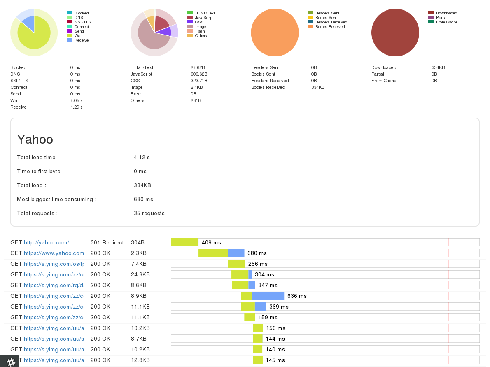

mithril-node-harviewer
=======================

A simple HAR viewer component for Mithril and NodeJS.

Usage
-----

    const harviewer = require('mithril-node-harviewer');

    const har = {...}

    const ctrl = harviewer.controller(har);
    const view = harviewer.view(ctrl);

Options
-------
No options for this version.

Test
----

Setup `npm install -g mct`, then:

    mct test .
